# Overview

Welcome to the `5N CPM`, short for `5N Canton Package Manager`, a performance and intuitive application designed to support Canton validator operation. The app simplifies the management of DAR files, users and party on the validator. It is designed to be lean, simple, and fast, easily deployable as a single binary written in Golang, with a low memory footprint. This single binary including both of the backend and the UI.

Beyond DAR file management, this application provides comprehensive support for managing parties and users directly on your Canton validator. You can effortlessly onboard new participants, manage their permissions, and ensure a secure and efficient operational environment.

One of the standout features is its interactive shell. This allows you to execute shell scripts directly within your Kubernetes cluster, with the output streamed in real-time to your browser. This capability provides unparalleled control and visibility, making debugging, deployment, and operational tasks significantly more efficient. All the common credential is auto populate and set in environment variable for your convenience.

5N CPM goal is to help developers and administrators with the tools needed to effectively deploy, monitor, maintain and backup both of the node and their Canton-based applications.

We welcome any feedback, email us at nodesupport@fivenorth.io

## Features

- Managar DAR files, multi uploads.
- Manage User&amp; Party.
- Auto Backup Node Identities and Database to cloud: support S3, GCS, and Wasabi and CloudFlare R2
- Interactive Shell Execution/History

## Demo Videos

### DARs management

<video controls>
  <source src="/assets/5n-cpm/2025-06-26 23-53-38 dar.mp4" type="video/mp4">
  Your browser does not support the video tag.
</video>

### Users management

<video controls>
  <source src="/assets/5n-cpm/2025-06-26 23-20-29 user.mp4" type="video/mp4">
  Your browser does not support the video tag.
</video>

### Parties management

<video controls>
  <source src="/assets/5n-cpm/2025-06-27 00-04-28.mp4" type="video/mp4">
  Your browser does not support the video tag.
</video>

### Shell execution

<video controls>
  <source src="/assets/5n-cpm/2025-06-27 00-17-44.mp4" type="video/mp4">
  Your browser does not support the video tag.
</video>

## Screenshots

### DAR files management

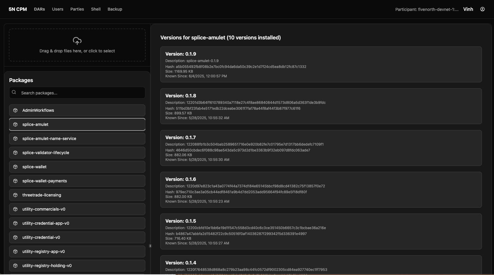{: width="20%"} 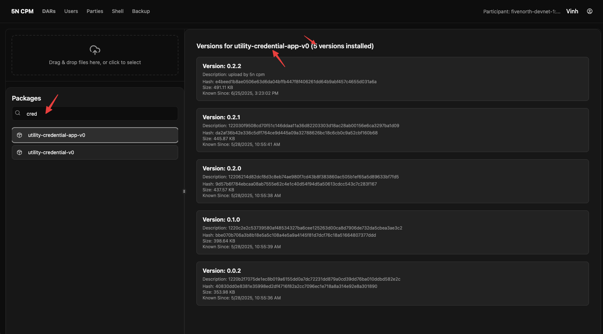{: width="20%"} 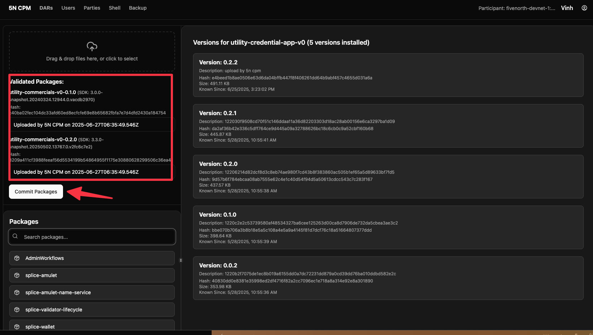{: width="20%"} 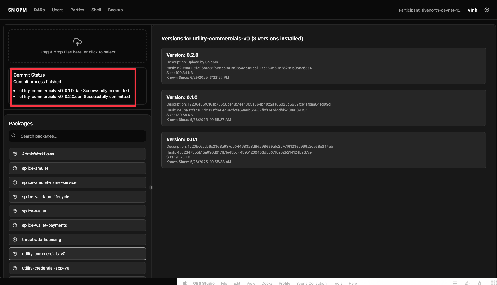{: width="20%"}

### Users Management
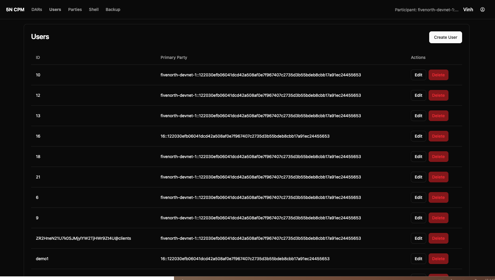{: width="25%"} 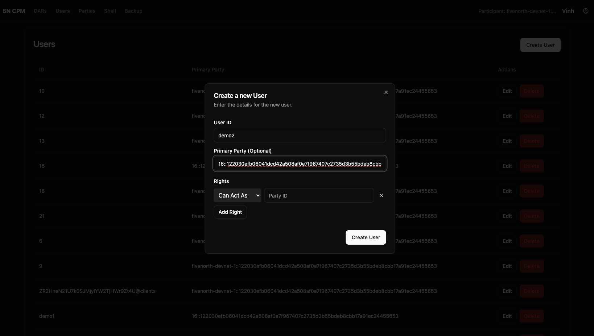{: width="25%"} 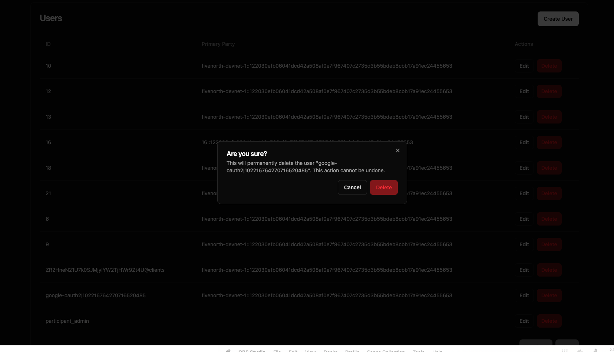{: width="25%"}

### Parties Management

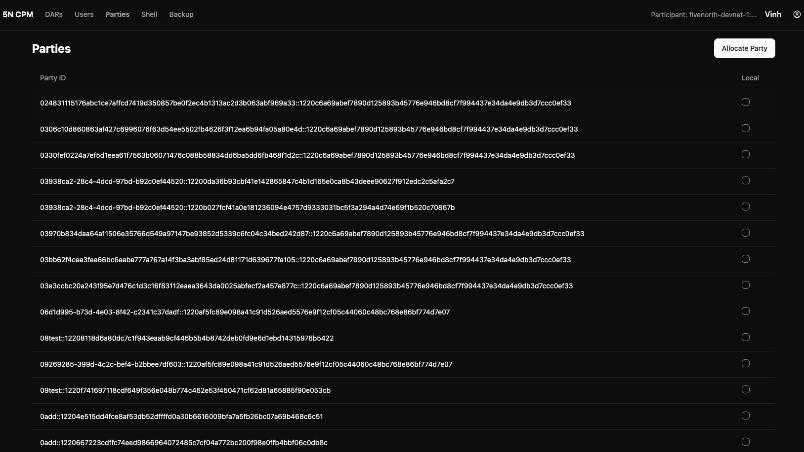{: width="25%"} 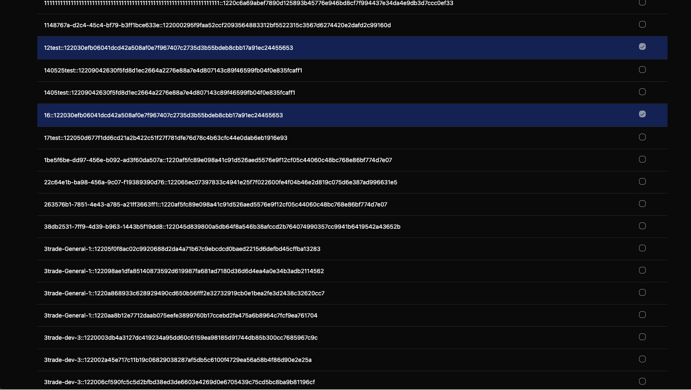{: width="25%"} 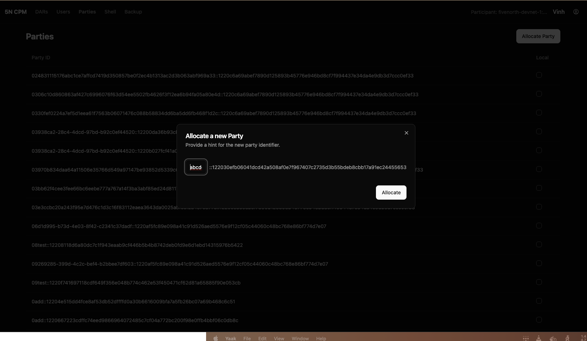{: width="25%"} 

### Backup

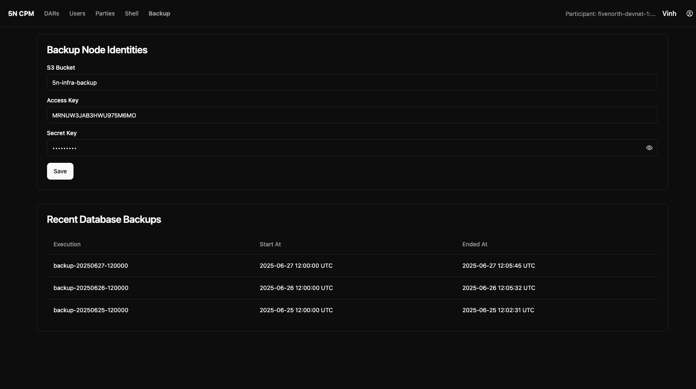{: width="25%"}

### Shell

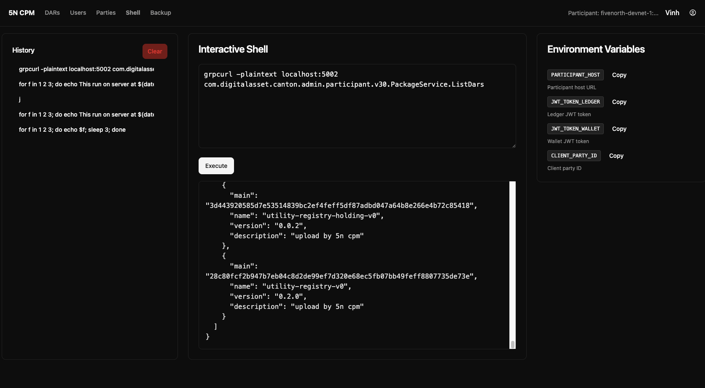{: width="25%"}

